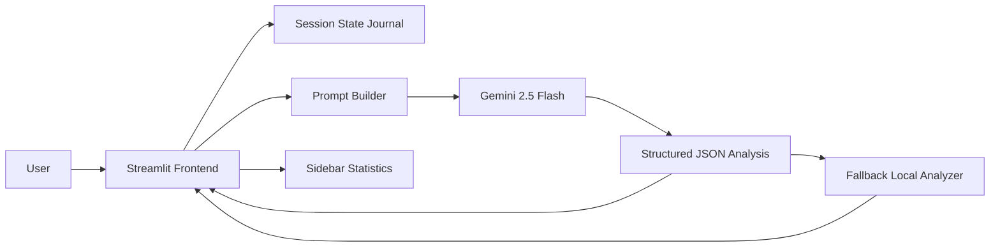

# MemorySpark AI

MemorySpark AI is a Streamlit web application for guided reminiscence, memory categorization, and cognitive stimulation. It uses Gemini 2.5 Flash to analyze a user's memory and return a structured reflection that can support dementia care, caregiver conversations, research workflows, and cognitive health programs.

## What it does

- Accepts a free-text memory from the user.
- Identifies the dominant memory theme: Family, Childhood, Friendship, Education, Travel, Celebration, Career, or Other.
- Produces a memory richness score from 1 to 10.
- Generates sensory recall prompts about sounds, smells, sights, and objects.
- Generates emotional reflection prompts about feelings, relationships, and meaning.
- Creates a short storytelling spark sentence starter.
- Stores each submitted memory in Streamlit session state.
- Summarizes sidebar statistics for total memories, most common theme, and average richness score.

## Project structure

- [app.py](app.py) - Streamlit application and Gemini analysis pipeline.
- [requirements.txt](requirements.txt) - Python dependencies.

## Local run

1. Install dependencies:

```bash
pip install -r requirements.txt
```

2. Set your Gemini API key as an environment variable:

```bash
export GEMINI_API_KEY="your_api_key_here"
```

3. Start the app:

```bash
streamlit run app.py
```

If you prefer Streamlit secrets, create `.streamlit/secrets.toml` with `GEMINI_API_KEY = "..."`.

## Deployment instructions

### Streamlit Community Cloud

1. Push the repository to GitHub.
2. Create a new Streamlit app from the repository.
3. Set `app.py` as the main file.
4. Add `GEMINI_API_KEY` in the app secrets or as a repository secret.
5. Deploy.

### Containerized deployment

The app only needs Python and the dependencies in `requirements.txt`, so it can also run in Docker, on a VM, or inside a research workstation with the same environment variable configuration.

## Architecture diagram



## Sample screenshot mockups

### 1. Main analysis view

The screen opens with a calm clinical header, a large memory input box, and a primary action button. After submission, the page shows the detected theme, richness score, sensory prompts, emotional reflection questions, and a short storytelling spark in separate bordered cards.

### 2. Sidebar insights

The sidebar presents compact metrics for total memories logged, the most common theme, and average richness score. Below the metrics, a short list of logged memories helps caregivers or researchers review recent entries quickly.

### 3. Empty-state view

Before any input is submitted, the app displays guidance text, example prompt suggestions, and a neutral clinical note explaining that the tool supports reflection rather than diagnosis.

## Notes

- The app falls back to a local heuristic analyzer if Gemini is unavailable, so the interface remains usable during setup or offline development.
- For production deployments, keep the API key in secrets or environment variables rather than hardcoding it into the source.
