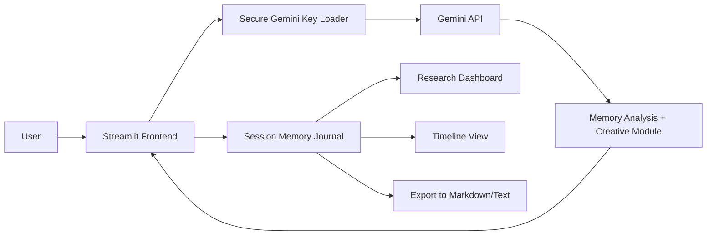

# MemorySpark AI

MemorySpark AI is a Streamlit research prototype for guided reminiscence, memory categorization, and cognitive stimulation. It uses Gemini to support memory analysis while keeping the application compatible with local development and Streamlit Cloud deployment.

## What it does

- Accepts a free-text memory and optional caregiver notes.
- Detects themes such as Family, Childhood, School, Travel, Friendship, Celebration, Career, and Other.
- Calculates memory richness from emotional, sensory, people, and place references.
- Classifies sentiment as Positive, Neutral, Reflective, or Melancholic.
- Generates the Creative Cognitive Stimulation Module with sensory recall questions, emotional reflection questions, a short poem, and a storytelling prompt.
- Stores every memory in Streamlit session state.
- Supports a sidebar journal, chronological timeline, charts, and export-ready output.

## Local run

1. Install dependencies:

```bash
pip install -r requirements.txt
```

2. Configure the Gemini API key securely:

```bash
export GEMINI_API_KEY="your_api_key_here"
```

Or create `.streamlit/secrets.toml` with:

```toml
GEMINI_API_KEY = "your_api_key_here"
```

3. Start the app:

```bash
streamlit run app.py
```

## Deployment instructions

### Streamlit Community Cloud

1. Push the repository to GitHub.
2. Create a new Streamlit app from the repository.
3. Set `app.py` as the entry point.
4. Add `GEMINI_API_KEY` in Streamlit secrets.
5. Deploy.

### Local development

1. Export `GEMINI_API_KEY` in your shell, or use `.streamlit/secrets.toml`.
2. Run `streamlit run app.py`.

## Architecture diagram



## Sample screenshot mockups

### 1. Main analysis view

The screen opens with a calm clinical header, a memory input area, and an optional caregiver notes field. After submission, the app shows the theme badges, richness analysis, sentiment, cognitive stimulation index, and the Creative Cognitive Stimulation Module in bordered panels.

### 2. Sidebar journal

The sidebar contains a selectable list of previous memories, recent-entry previews, and a clear-journal action. Choosing an entry loads it into the main panel for review.

### 3. Research dashboard and analytics

The dashboard shows metric cards for total memories, average richness, most common theme, and session length. Below that, Plotly charts summarize theme distribution, richness over time, and sentiment distribution.

## Notes

- The application stops with a Streamlit error if `GEMINI_API_KEY` is missing.
- No API keys are hardcoded into the source.
- The app stays in a single Python file for simple deployment.
